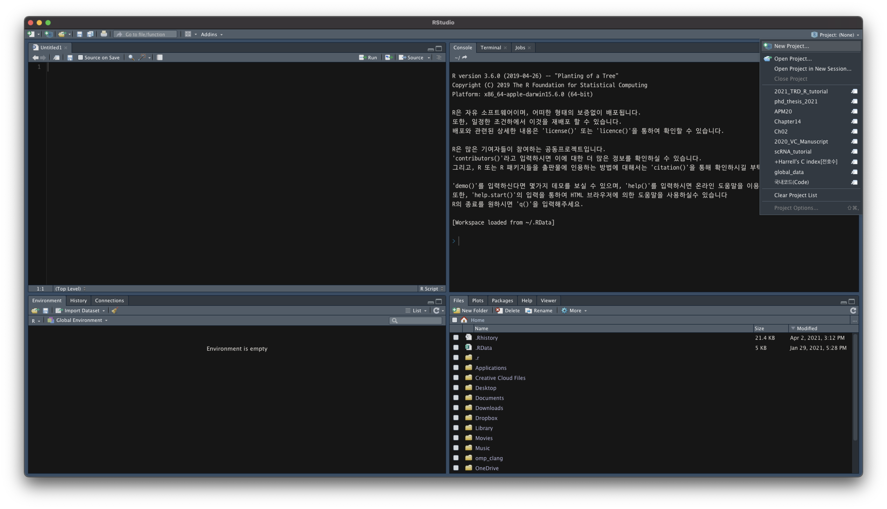

```{r setup, include=FALSE}
knitr::opts_chunk$set(echo = TRUE)
```

## R environment setting
* 설치 방법은 [prerequisite](00_pre_requisite.html) 파일을 참고하시면 됩니다. 
* Rstudio: Integrated Development Environment (IDE) 통합 개발 환경으로 R에 특화된 (최근에는 python도 지원) 개발도구 

## R studio
* Rstudio 화면구성

  기본적으로 Rstudio는 4개의 창(pane)으로 구성되어 있다. 
    1. **Source** - 대부분 code나 notebook을 띄우는 창
    2. **Console** - 실제 명령어가 실행되는 창
    3. **Environment** - 현재 메모리에서 사용하고 있는 변수, 함수 등을 보여주는 창
    4. **Files / Plot / View / Help** - 현재 폴더의 파일, 그림, 결과물, 도움말 등을 확인할 수 있는 창
    
  

* Rstudio 생성 파일 종류


* Rstudio pane 구성


* Rstudio project 관리


## (Tip) R notebook or R markdown

* R notebook/markdown은 R로 문서 형태로 만들 수 있다. 
  + 분석 결과를 다시 보기 위해서 코드를 다시 실행시킬 필요가 없다
  + 쉽게 문서 파일로 만들 수 있다
  
* Start: File > New File > R Notebook or R Markdown
* Insert code chunk: <kbd>Ctrl</kbd> + <kbd>Alt</kbd> + <kbd>I</kbd>
* Execute code chunk: <kbd>Ctrl</kbd> + <kbd>Shift</kbd> + <kbd>Enter</kbd> 
* Render / Save Notebook file : <kbd>Ctrl</kbd> + <kbd>Shift</kbd> + <kbd>K</kbd> 


## R project 설정
### R poject 시작
* project와 관련된 code와 source들을 한꺼번에 관리할 수 있다. 

### (TIP) path의 설정: here package 
* 상대경로 -> 절대경로 
* here은 현재 Rproj의 위치를 기준으로 절대경로를 반환한다 

```{r message=F}
library(here)
here('data/raw')
```


