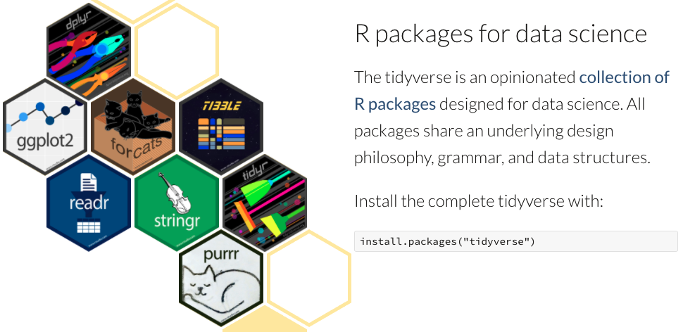

```{r setup, include=FALSE}
knitr::opts_chunk$set(echo = TRUE, error = TRUE, message = FALSE)
library(here)
options(scipen = 999)
```

## Tidyverse package
* `tidyverse` package
tidyverse package는 여러 개의 package로 구성되어 있습니다. 유용한 다양한 기능들이 있습니다. 

```{r message = TRUE}
library(tidyverse)
```

## Read data
### Read CSV file

  `readr::read_csv()`
  
  - 처음 1000개의 열로 데이터의 형태를 유추해서 추출한다. 
  - 따라서, 에러가 나는 경우는 column type을 정해줘야 한다. 
```{r}
patients <- readr::read_csv(here('data/raw/tutorial_patients.csv'))
patients
```

### Tip) csv 문서가 깨지는 경우
1. UTF-8로 다시 저장 - excel에서 새이름으로 저장 

```{r echo = FALSE, message=FALSE, out.width='50%'}
knitr::include_graphics(here('src/excel_save_as.png'))
```

2. 한글이 포함된 문서 읽을 때 Error가 나는 경우 
  * 기존: UTF-8
  * 변경: CP949 or EUC-KR

```{r eval=FALSE, error=TRUE, message=FALSE, warning=TRUE}
readr::read_csv(file=here('data/raw/tutorial_patients_CP949.csv'))
```

```{r}
readr::read_csv(file=here('data/raw/tutorial_patients_CP949.csv'), locale = readr::locale(encoding = "EUC-KR"))
```

### Read Excel File
  * `readxl::excel_sheets()`: 엑셀 파일에 포함된 spreadsheet의 종류 확인
  * `readxl::read_excel()`: 엑셀파일을 읽을 때 

```{r}
library(readxl)
readxl::excel_sheets(here('data/raw/tutorial_patients.xlsx'))
readxl::read_excel(here('data/raw/tutorial_patients.xlsx'))
```

### Tip) 데이터를 복사 해서 R에 복사하는 방법(feat. datapasta)

```{r}
library(datapasta)
tibble::tribble(
  ~subject_id, ~gender, ~anchor_age, ~anchor_year,        ~dod,
    19194449L,     "M",         57L,        2119L,          NA,
    12207593L,     "M",         43L,        2193L,  "2194.5.6",
    10656173L,     "F",         33L,        2176L,          NA,
    10208468L,     "M",         87L,        2134L,          NA,
    10682002L,     "M",         55L,        2132L,          NA,
    18860233L,     "F",         54L,        2191L,          NA,
    16828280L,     "M",         84L,        2141L,          NA,
    12851972L,     "F",         91L,        2112L,          NA,
    14923903L,     "M",         81L,        2138L,          NA,
    10836215L,     "M",         62L,        2142L,          NA,
    11679839L,     "F",         82L,        2112L,          NA,
    13050109L,     "F",         82L,        2166L, "2174.3.11"
  )

```

## Data Wrangling - **dplyr**, **tidyr** packages

참고) `package::command`

#### 원본 데이터
```{r}
patients
```

### **dplyr::select** 
* 원하는 column을 선택하거나 column의 이름을 바꾸는데 사용 
```{r}
select(patients, subject_id, gender, anchor_age)
```

```{r}
select(patients, 등록번호=subject_id, 성별=gender, 나이=anchor_age)
```

## **dplyr::filter**
* 조건을 걸어 열을 선택할 때 사용

```{r}
filter(patients, gender == 'M', anchor_age > 65)
```
```{r}
filter(patients, !is.na(dod))
```

### **pipe %>%**
* 명령어를 이어서 적용해주는 역할을 한다. 
* 단축키: <kbd>Ctrl</kbd> + <kbd>Alt</kbd> + <kbd>M</kbd>

```{r}
patients %>% 
  select(subject_id, gender, anchor_age) %>% 
  filter(gender == 'M', anchor_age > 65)
```

### **dplyr::mutate()**
* 새로운 column을 만들거나 기존의 column을 변경시 사용
* `ifelse(조건문, 조건문 만족시 반환값, 조건문 불만족시 반환값)`

```{r}
patients %>% mutate(gender = ifelse(gender == 'M', 'Male', 'Female'))
```

### Combine >= 2 tables

#### dplyr::bind_rows / dplyr::bind_cols
* table과 table을 합칠때.
  - 세로로 합칠 때는 `bind_rows`
  - 가로로 합칠 때는 `bind_cols`
  
* for (변수 in 리스트){}
```{r}
for (i in c(1, 2, 3)){
  print(i)
}
```

* `glue::glue()`
```{r  message=FALSE}
library(glue)
name = 'TRD'
year = '2021'

glue('Here we in {name} {year}')
```
```{r message = FALSE}
table1 <- readr::read_csv(here('data/raw/tutorial_patient1.csv'))
table2 <- readr::read_csv(here('data/raw/tutorial_patient2.csv'))
table3 <- readr::read_csv(here('data/raw/tutorial_patient3.csv'))
table4 <- readr::read_csv(here('data/raw/tutorial_patient4.csv'))
result <- bind_rows(table1, table2, table3, table4)
result
```

```{r}
filenames = c('tutorial_patient1.csv', 'tutorial_patient2.csv', 'tutorial_patient3.csv', 'tutorial_patient4.csv')

result = tibble()
for (f in filenames){
  path = here(glue('data/raw/{f}'))
  table <- readr::read_csv(path)
  result = bind_rows(result, table)
}

result
```

#### dplyr::join
* key를 기준으로 두 테이블을 합친다. 

```{r}
icustays <- readr::read_csv(here('data/raw/tutorial_icustays.csv'))
patients <- readr::read_csv(here('data/raw/tutorial_patients.csv'))
icustays
patients
```
```{r}
icustays %>% left_join(patients, by = 'subject_id')
```

#### dplyr::arrange

* column 순서대로 정렬

```{r}
patients %>% head(10) %>% arrange(anchor_age)
patients %>% head(10) %>% arrange(desc(anchor_age))
```

#### dplyr::group_by / dplyr::summarize

```{r}
icustays %>% 
  left_join(patients, by = 'subject_id') %>% 
  group_by(gender) %>% 
  summarize(los_mean = mean(los),
            los_sd = sd(los),
            age_mean = mean(anchor_age),
            age_sd = sd(anchor_age))
```
```{r}
icustays %>% 
  left_join(patients, by = 'subject_id') %>% 
  group_by(first_careunit, gender) %>% 
  summarize(los_mean = mean(los),
            los_sd = sd(los),
            age_mean = mean(anchor_age),
            age_sd = sd(anchor_age))
```

#### tidyr::pivot_wider

```{r}
labevents <- readr::read_csv(here('data/raw/tutorial_labevents.csv'))
```

```{r}
labs <- icustays %>% 
  left_join(labevents) %>% 
  group_by(label) %>% 
  filter(charttime == min(charttime)) %>% 
  select(ends_with('id'), label, value, charttime, intime, outtime) %>% 
  pivot_wider(id_cols = c('subject_id', 'hadm_id', 'stay_id'), names_from = label) 
  
colnames(labs)
labs %>% select(ends_with('id'), 
                `White Blood Cells`, 
                `Red Blood Cells`, 
                `Platelet Count`, 
                `Alanine Aminotransferase (ALT)`,
                `Asparate Aminotransferase (AST)`,
                Creatinine,
                Sodium,
                Potassium,
                Chloride,
                Bicarbonate)
```

#### tidyr::pivor_longer()
```{r}

```


