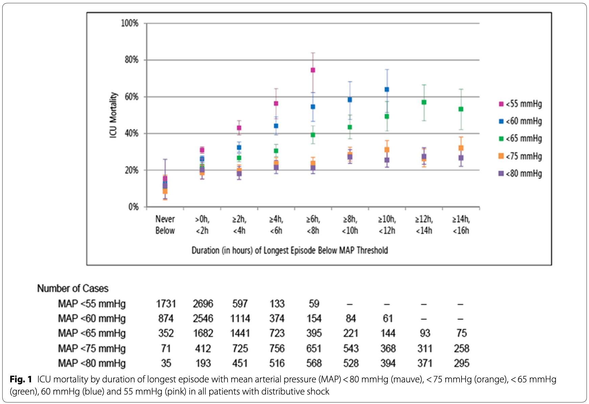
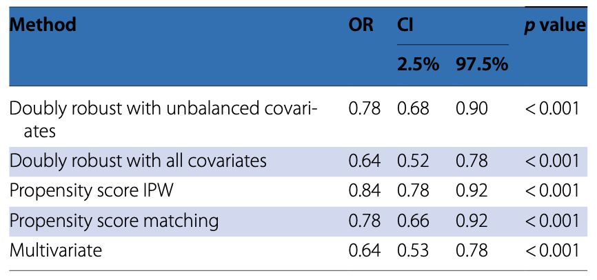
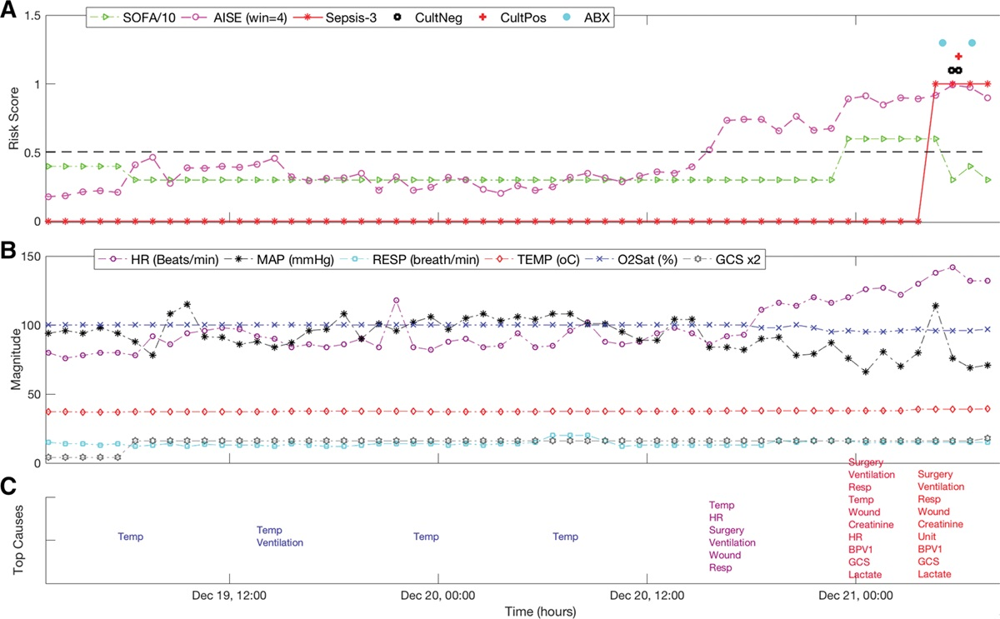
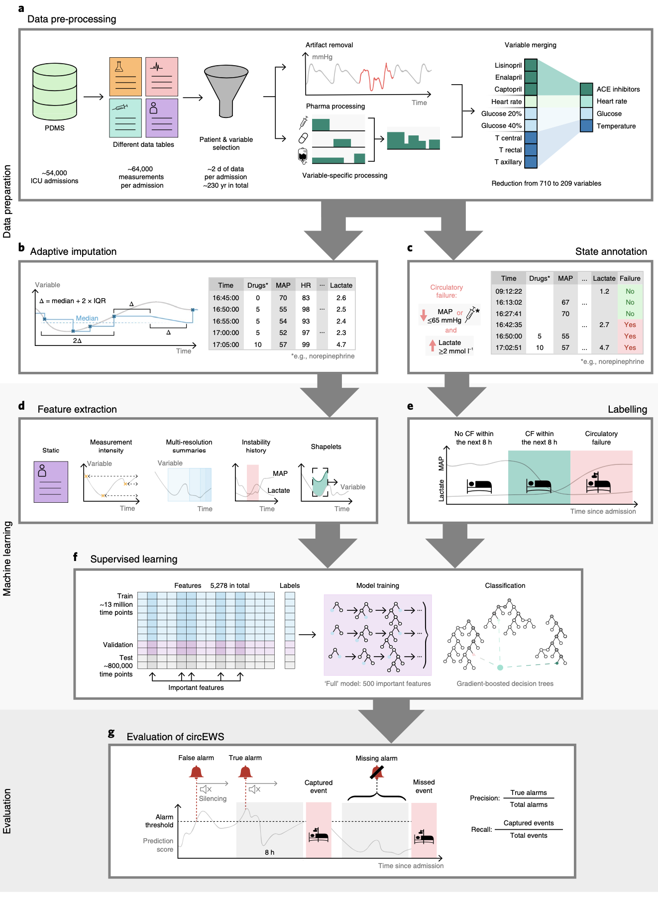
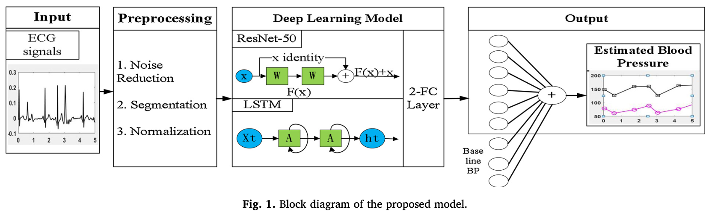
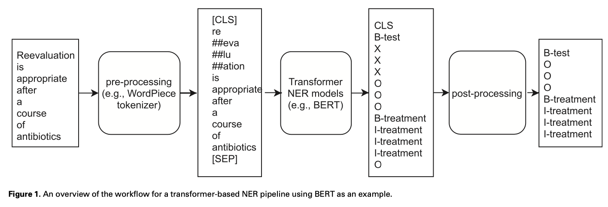

```{r setup, include=FALSE}
library(DT)
library(here)
library(magrittr)
source(here('code/db_connect.R'))
```

class: inverse, center, middle

# Introduction
---
## MIMIC-III
* Provide critical care data for over 40,000 patients <br>
admitted to ICU at the Beth Israel Deaconess Medical Center (BIDMC).

* deidentified, and patient identifiers were removed 

* MIMIC-III has been integral in driving large amounts of research in clinical informatics, epidemiology, and machine learning.
---
## MIMIC-IV
* MIMIC-IV is intended to carry on the success of MIMIC-III

* Support a broad set of applications within healthcare.

* MIMIC-IV adopts a modular approach to data organization, 

* Highlight data provenance 

* Facilitate both individual and combined use of disparate data sources.
---
## Methods
### Acquisition
  - Inclusion criteria
      - who were admitted to the BIDMC ED or any the ICU, 2008 - 2019.
  - Extracted from the respective hospital databases
  - A master patient list was created 
  - All source tables were filtered to only rows related to patients in the master patient list.

### Preparation
- The data were reorganized to better facilitate retrospective data analysis. 
  - the de-normalization of tables
  - removal of audit trails
  - reorganization into fewer tables
  - to simplify retrospective analysis of the database. 
- Data cleaning steps were not performed
  - to ensure the data reflects a real-world clinical dataset.

---

## Methods
### De-identify
  - Patient identifiers as stipulated by HIPAA were removed. 
  - Patient identifiers were replaced using a random cipher, resulting in deidentified integer identifiers for patients, hospitalizations, and ICU stays. 
  - Structured data were filtered using look up tables and allow lists. 
  - If necessary, a free-text deidentification algorithm was applied to remove PHI from free-text. 
  - Finally, date and times were shifted randomly into the future using an offset measured in days. A single date shift was assigned to each subject_id. As a result, the data for a single patient are internally consistent. 

---
class: inverse, center, middle
# Backgrouds for hostpital data
### How the patient data have been generated?

---
# CASE
### Think about patient flows in hospital
* Patient

--
* Admission

--
* Chartevents

--
* Provider orders(poe)/medication administration(emar)

--
* Labevents

--
* Chest X ray

--
* Diagnoses_icd

--
* Transfer

--
* chartevents
* datetimeevents
* inputevents
* outputevents
* procedureevents

--
* icustays

---
class: inverse, center, middle

# Papers from MIMIC data
### Researches based on MIMIC data
Clinical <br>
Model for clinicians <br>
Algorithm <br>
---
### Mean arterial pressure and mortality in patients with distributive shock: a retrospective analysis of the MIMIC-III database (Annals of Intensive Care, 2018)
```{r echo = F, message = F, fig.align='center', out.width='60%'}

```
.footnote[
Vincent, JL., Nielsen, N.D., Shapiro, N.I. et al. Mean arterial pressure and mortality in patients with distributive shock: a retrospective analysis of the MIMIC-III database. Ann. Intensive Care 8, 107 (2018).
]
---
### Transthoracic echocardiography and mortality in sepsis: analysis of the MIMIC-III database (ICM, 2018)
```{r echo = F, message = F, fig.align='center', out.width='90%'}

```
.footnote[
Feng, M., McSparron, J.I., Kien, D.T. et al. Transthoracic echocardiography and mortality in sepsis: analysis of the MIMIC-III database. Intensive Care Med 44, 884–892 (2018).
]
---
### An Interpretable Machine Learning Model for Accurate Prediction of Sepsis in the ICU (CCM 2018)
```{r echo = F, message = F, fig.align='center', out.width='80%'}

```
.footnote[
Nemati, Shamim et al., An Interpretable Machine Learning Model for Accurate Prediction of Sepsis in the ICU, Critical Care Medicine: April 2018 - Volume 46 - Issue 4 - p 547-553
]
---
### Early prediction of circulatory failure in the intensive care unit using machine learning (Nature Medicine 2020)
```{r echo = F, message = F, fig.align='center', out.width='35%'}

```
.footnote[
Hyland, Stephanie L., et al. "Early prediction of circulatory failure in the intensive care unit using machine learning." Nature medicine 26.3 (2020): 364-373.
]
---
### Continuous blood pressure measurement from one-channel electrocardiogram signal using deep-learning techniques(Artificial Intelligence in Medicine, 2020)
<br>
```{r echo = F, message = F, fig.align='center', out.width='100%'}

```
.footnote[
Fen Miao et al., Continuous blood pressure measurement from one-channel electrocardiogram signal using deep-learning techniques, Artificial Intelligence in Medicine, Volume 108, 2020
]
---
### Clinical concept extraction using transformers (JAMIA 2020)
<br>
<br>
```{r echo = F, message = F, fig.align='center', out.width='100%'}

```
.footnote[
Xi Yang, Jiang Bian, William R Hogan, Yonghui Wu, Clinical concept extraction using transformers, Journal of the American Medical Informatics Association, Volume 27, Issue 12, December 2020, Pages 1935–1942,
]
---
class: inverse, center, middle

# Tables 
### What kind of data the MIMIC has?
---
## Modular structure of MIMIC IV - Core
* [Patients](https://mimic.mit.edu/docs/iv/modules/core/patients/)
  - Information that is consistent for the lifetime of a patient is stored in this table.
      
* [Admissions](https://mimic.mit.edu/docs/iv/modules/core/admissions/)
  - The admissions table gives information regarding a patient’s admission to the hospital. Since each unique hospital visit for a patient is assigned a unique `hadm_id`, the admissions table can be considered as a definition table for `hadm_id`. Information available includes timing information for admission and discharge, demographic information, the source of the admission, and so on.

* [Transfers](https://mimic.mit.edu/docs/iv/modules/core/transfers/)
  - Physical locations for patients throughout their hospital stay.


---
## Modular structure of MIMIC IV - Hosp
* laboratory measurements ([labevents](https://mimic.mit.edu/docs/iv/modules/hosp/labevents/)), 

* microbiology cultures ([microbiologyevents](https://mimic.mit.edu/docs/iv/modules/hosp/microbiologyevents/)), 

* provider orders ([poe](https://mimic.mit.edu/docs/iv/modules/hosp/poe/), [poe_detail](https://mimic.mit.edu/
docs/iv/modules/hosp/poe_detail/)), 

* medication administration ([emar](https://mimic.mit.edu/docs/iv/modules/hosp/emar/), [emar_detail](https://mimic.mit.edu/docs/iv/modules/hosp/emar_detail/)), 

* medication prescription ([prescriptions](https://mimic.mit.edu/docs/iv/modules/hosp/prescriptions/), [pharmacy](https://mimic.mit.edu/docs/iv/modules/hosp/pharmacy/)), 

* hospital billing information ([diagnoses_icd](https://mimic.mit.edu/docs/iv/modules/hosp/diagnoses_icd/), [procedures_icd](https://mimic.mit.edu/docs/iv/modules/hosp/diagnoses_icd/), [hcpcsevents](https://mimic.mit.edu/docs/iv/modules/hosp/hcpcsevents/)]), and 

* service(department information) related information ([services](https://mimic.mit.edu/docs/iv/modules/hosp/services/)).

---
## Modular structure of MIMIC IV - ICU
* charted information ([chartevents](https://mimic.mit.edu/docs/iv/modules/icu/chartevents/)).
  - Charted items occurring during the ICU stay. Contains the majority of information documented in the ICU.

* intravenous and fluid inputs ([inputevents](https://mimic.mit.edu/docs/iv/modules/icu/inputevents/))
  - Information documented regarding continuous infusions or intermittent administrations.

* patient outputs ([outputevents](https://mimic.mit.edu/docs/iv/modules/icu/outputevents/))
  - Information regarding patient outputs including urine, drainage, and so on.

* procedures ([procedureevents](https://mimic.mit.edu/docs/iv/modules/icu/procedureevents/))
  - Procedures documented during the ICU stay (e.g. ventilation), though not necessarily conducted within the ICU (e.g. x-ray imaging).

* information documented as a date or time ([datetimeevents](https://mimic.mit.edu/docs/iv/modules/icu/datetimesevents/))
  - Documented information which is in a date format (e.g. date of last dialysis).


---
## Modular structure of MIMIC IV - code dictionary
#### [d_icd_diagnoses](https://mimic.mit.edu/docs/iv/modules/hosp/d_icd_diagnoses/)
  - Dimension table for diagnoses_icd; provides a description of ICD-9/ICD-10 billed diagnoses.

#### [d_icd_procedures](https://mimic.mit.edu/docs/iv/modules/hosp/d_icd_procedures/)
  - Dimension table for procedures_icd; provides a description of ICD-9/ICD-10 billed procedures.

#### [d_labitems](https://mimic.mit.edu/docs/iv/modules/hosp/d_labitems/)
  - Dimension table for labevents; provides a description of all lab items.

#### [d_itmes](https://mimic.mit.edu/docs/iv/modules/icu/d_items/)
  - Dimension table describing itemid. Defines concepts recorded in the events table in the ICU module.


---
class: inverse, center, middle
# Other data related to MIMIC

---
## MIMIC-CXR (MIMIC IV)

.footnote[
1. Johnson AE, Pollard TJ, Berkowitz SJ, Greenbaum NR, Lungren MP, Deng CY, Mark RG, Horng S. MIMIC-CXR, a de-identified publicly available database of chest radiographs with free-text reports. Scientific Data. 2019;6.
2. https://github.com/MIT-LCP/mimic-cxr
]
---
## MIMIC-Waveform (MIMIC III)
- Waveforms almost always include one or more ECG signals, and often include continuous arterial blood pressure (ABP) waveforms, fingertip photoplethysmogram (PPG) signals, and respiration, with additional waveforms (up to 8 simultaneously) as available. 
- Numerics typically include heart and respiration rates, SpO2, and systolic, mean, and diastolic blood pressure, together with others as available. 
- Recording lengths also vary; most are a few days in duration, but some are shorter and others are several weeks long.

.footnote[
https://physionet.org/content/mimic3wdb/1.0/
]
---
class: inverse, center, middle

# How to access the data
---
## Access

.left-code[
```{sql, connection=con, output.var = "tables"} 
SHOW tables;
```
]

.right-plot[
```{r echo=FALSE}
DT::datatable(tables,   
              extensions = 'Scroller',
              rownames = FALSE,
              options = list(
                dom = 't',
                scrollY = 400, # 이것으로 y의 크기를 조절한다. 
                scroller = TRUE,
                headerCallback = DT::JS(
                  "function(thead) {",
                  "  $(thead).css('font-size', '.75em');",
                  "}"))
              )
```
]
---
```{sql, connection=con, output.var = "chartevents"} 
SELECT * FROM chartevents WHERE itemid IN (220050, 220051, 220052, 220045, 220210, 223762) LIMIT 20;
```
```{r echo=FALSE}
chartevents %>% 
  DT::datatable(rownames = FALSE,
                options = list(
                  dom = 't',
                  pageLength = 20,
                  scroller = TRUE,
                  scrollY = 400, 
                  scrollX = 600,
                  headerCallback = DT::JS(
                    "function(thead) {",
                    "  $(thead).css('font-size', '.75em');",
                    "}")
                  )) %>%
  DT::formatStyle(columns = colnames(chartevents) , fontSize = '13px')
```
---
```{sql, connection=con, output.var = "d_labitems"} 
SELECT * FROM d_labitems LIMIT 10;
```

```{r echo=FALSE}
DT::datatable(d_labitems,
              extensions = 'Scroller',
              rownames = FALSE,
              options = list(
                dom = 't',
                scrollY = 170, # 이것으로 y의 크기를 조절한다. 
                scroller = TRUE,
                scrollX = TRUE,
                headerCallback = DT::JS(
                  "function(thead) {",
                  "  $(thead).css('font-size', '.75em');",
                  "}"
                ))) %>% 
  DT::formatStyle(columns = colnames(d_labitems), fontSize = '13px')
```

```{sql, connection=con, output.var = "labevents"} 
SELECT * FROM labevents LIMIT 10;
```

```{r echo=FALSE}
DT::datatable(labevents,
              extensions = 'Scroller',
              rownames = FALSE,
              options = list(
                dom = 't',
                scrollY = 170, # 이것으로 y의 크기를 조절한다. 
                scrollX = TRUE,
                scroller = TRUE,
                headerCallback = DT::JS(
                  "function(thead) {",
                  "  $(thead).css('font-size', '.75em');",
                  "}")
              )) %>% 
  DT::formatStyle(columns = colnames(labevents), fontSize = '13px')
```
---
# Reference
1. [https://physionet.org/content/mimiciv/1.0/](https://physionet.org/content/mimiciv/1.0/)
2. [https://mimic.mit.edu/iv/](https://mimic.mit.edu/iv/)
