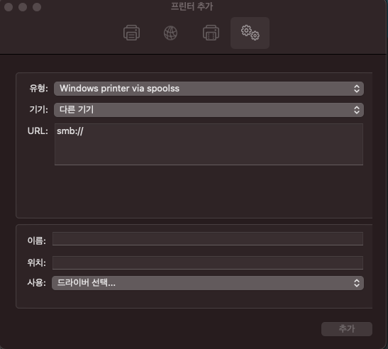
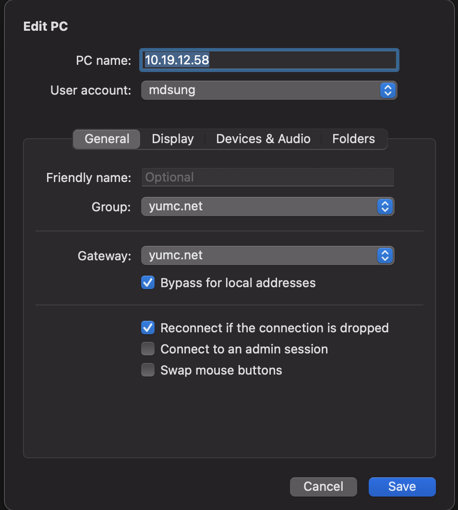
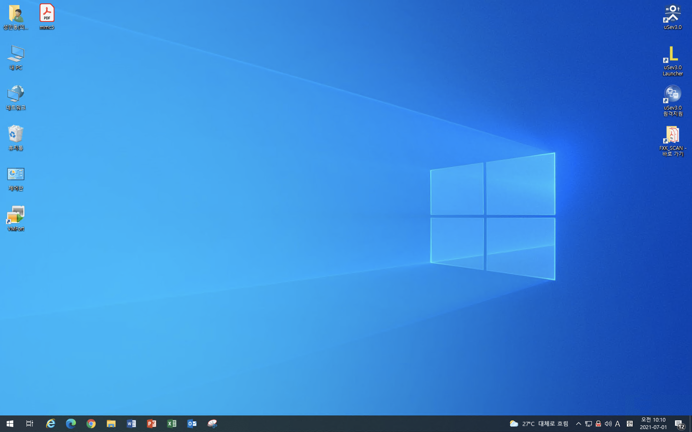
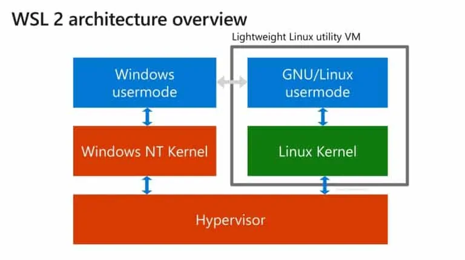
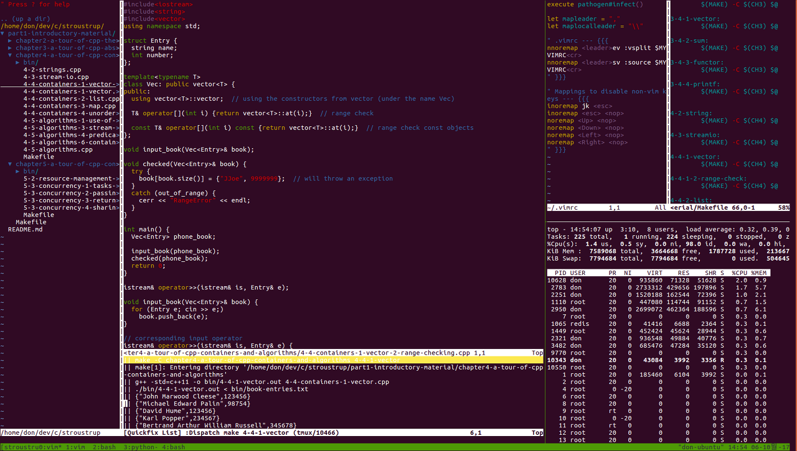
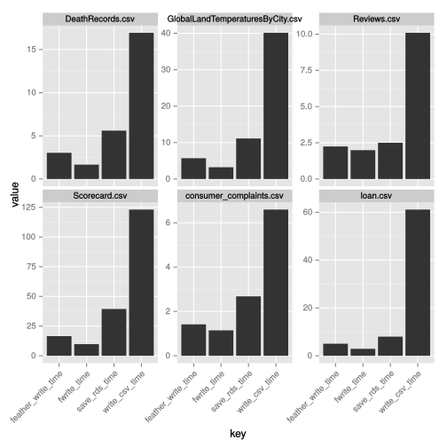

```{r setup, include=FALSE}
```
# Disclosure
- Main langauage - python, R, go

- Using Visual Studio code, R-Studio.

- Using both Mac and Windows 

- I'm not a developer. I'm a doctor.

- I own some stock in Microsoft.

- 제가 하는 방식은 완벽하지 않으며, 반드시 이렇게 해야한다는 것은 아닙니다. 

---
class: center, middle

# Development Environment

---
class: center, middle
# Wireless Lan
---
# YUHS-external
- 그룹웨어 ID / Password 이용해서 접속 가능
---
## Connect to Print(for Mac)
1. 윈도우 프린트 공유가 필요하고 **공유 위치(ip)**와 **공유 프린트 이름**이 필요하다.
    - IP: 10.19.12.58
    - Printer Name: Kyocera FS-4025DN KX
1. smb://[IP address of Printer]로 접속하여 인증을 한다. 
1. 프린트 추가 - 고급
    - 유형: windows printer via spoolss
    - 기기: 다른기기
    - URL: smb://10.19.12.58/Kyocera%20FS-4025DN%20KX
        - 빈칸에 **%20**을 입력한다.
    - 사용은 소프트웨어가 있으면 좋겠지만 없으면 일반 postscript 프린트로 설정

```{r echo = F, message = F, fig.align='center', out.width='30%'}

```
---
## Connect to PC (feat. Microsoft Remote Desktop)
```{r echo = F, message = F, fig.align='center', out.width='80%'}

```
---
## Connect to PC (feat. Microsoft Remote Desktop)
```{r echo = F, message = F, fig.align='center', out.width='100%'}

```

---
class: center, middle

# Development Environment
### Terminal
### Shell
### tmux
### Intergrated Development Environment


---
class: inverse, center, middle
# Terminal

---
# Terminal (Windows)
- putty? Terminal!
- 이전에는 open ssh가 지원이 되지 않아서 putty가 필요했으나 최근에는 필요가 없음
- 예시)
```{bash, eval = FALSE}
ssh mindong@103.22.220.153 -p10022
```
---
# WLS2 (Windows Subsystem Linux 2)
* 윈도우 내에서 linux를 사용할 수 있습니다!!
* 윈도우 터미널 환경이 불편하다면 WSL2가 대안이 될 수 있습니다. 
```{r fig.align='center', out.width='100%', echo = FALSE}

```
* Install protocol: [https://github.com/mdsung/wsl2_install_tutorial](https://github.com/mdsung/wsl2_install_tutorial)

---
# iTerm2 (Mac) (vs. Terminal.app)

---
# Shell
* bash

* zsh

* fish

cf. .bashrc/.zshrc

cf. https://medium.com/harrythegreat/oh-my-zsh-iterm2%EB%A1%9C-%ED%84%B0%EB%AF%B8%EB%84%90%EC%9D%84-%EB%8D%94-%EA%B0%95%EB%A0%A5%ED%95%98%EA%B2%8C-a105f2c01bec

---
# Commonly using shell command
* `head` / `tail` / `cat` / `less` - reader
* `ls` / `ls -lash`
* `cd` - change directory
  - `cd ~` - home directory
  - `cd /` - root directory
* `mkdir` - make directory
* `rm` / `rm -r` - remove
* `cp` / `mv` - copy / move
* `scp` - ssh copy
* `vim` -> `code`
* `!!` - lastest command
  - sudo !!

---
# tmux 
- Terminal 창으로 여러개 띄울 수 있다. (한꺼번에 보는 것도 가능)
  - pane
  - window
- Terminal이 닫혀도 session이 종료되지 않는다.

<br>

```{r fig.align='center', out.width='80%', echo = FALSE}

```

---
# IDE
- Jupyter Vs. VS Code (Vs. Pycharm)
- 대부분 Jupyter에서 하는 것을 VS Code에서 할 수 있다.
  - 원격 개발이 가능
  - 필요시 jupyter notebook도 실행 가능
- 파일 관리가 쉽다.
- Web browser 형태가 아닌 프로그램 형태로 프로그램을 띄우기 쉽다.
- 여러가지 extension이 있어 개발할 때 편하다.

---
# VS code
* python
* python jupyter
* python integration shell(like jupyter) - #%%

* 원격 접속 개발
  - ssh key 이용 시 password 없이 접속 가능 
  
* 여러가지 단축키
  - `alt` + `위`/`아래`
  - `alt` + `shift` `위`/`아래`
  - `ctrl`/`cmd` + `d` - 같은 것 선택
  - `ctrl`/`cmd` + / - 주석처리

---
class: center, middle

### 조금만 관심을 가지고 찾아보면 
### 인생을 조금 더 편하게 살 수 있습니다.
---
class: center, middle
# Project Management
## (feat. Reproduciable Research)

---
# Project structure
- `code/`
- `data/`
  - `raw/`
  - `processed/`
- `explore/`
- (optional) `proposal/`
- (optional) `manuscript/`
- (optional) `presentation/`
- `.gitignore`
- `Makefile`
- `README.md`

c.f. https://github.com/mdsung/2020_KISA_blockchain_survey

---
# [R] Project 
- 프로젝트별로 데이터 및 파일을 관리할 수 있어 여러 프로젝트를 동시에 진행할 때 organize하게 진행할 수 있다. 

- library `here`
  - make your path absolute and unified based on the project folder
  
- library `renv`
  - save your dependencies
  - `renv::init()`
  - `renv::snapshot()`
  - `renv::restore()`

---
# [Python] Project
- Make virtualenvironment to set your project
  - `python -m venv env`
  
- Save your dependencies in the txt file
  - `pip freeze > requirements.txt`
  
---
# [R] R notebook or R markdown
  - Rscript에서 작업을 많이 하지만, notebook이나 document를 이용하면, 기록하고 공유할 때 편하다.
  - `output:` 여러가지 형태로 변환이 가능하다.
      - html_notebook
      - html_document
      - github_document
      - word_document
      - pdf_document

# [Python] Jupyter notebook
  - `jupyter nbconvert` 
  - 공유시 html 파일로 변환 후 공유하면 좀 더 편하다

---
# git / github
- version 관리 프로그램
- code 백업
- (협업?)
- project별로 repository를 구성하면 webpage에서 분석 결과를 쉽게 확인할 수 있다. 

c.f. https://github.com/mdsung/2021_scRNA_PMBC_replicate

---
# `code` 관리
- code는 하나의 일을 하는 것이 좋다 
- naming은 항상 중요하다.

  e.g. create_preprocess_dataset.R 
  e.g. create_figure1.R
  
---
# `data/processed` 관리
- Use `feather` file
  - `feather` format can be read in both R and Python.
  - c.f `RDS` format is the way faster than `feather`.
```{r echo = FALSE, fig.align = 'center', out.width='50%'}

```
.footnote[
https://blog.dominodatalab.com/the-r-data-i-o-shootout/
]
---
# .gitignore
- github에 모든 파일을 올릴 수는 없다. 
- data 특히 raw는 올리지 않을 것이 좋다. 
- 민감한 정보를 분석할 때에는 code만 올리는 것을 고려
- 예시)
```{bash, eval = FALSE}
env/
data/raw/
**/__pycache__/
.DS_Store

```
---
# github 기본 이용법
- `git init` / `git clone`
- `git add`
- `git commit -m "first commit"`
- `git push`
- `git pull`

---
# Others...
- `Makefile` - save your work process
